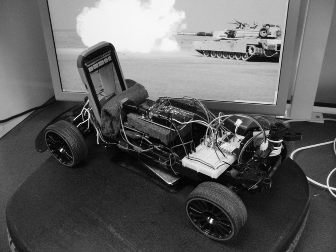
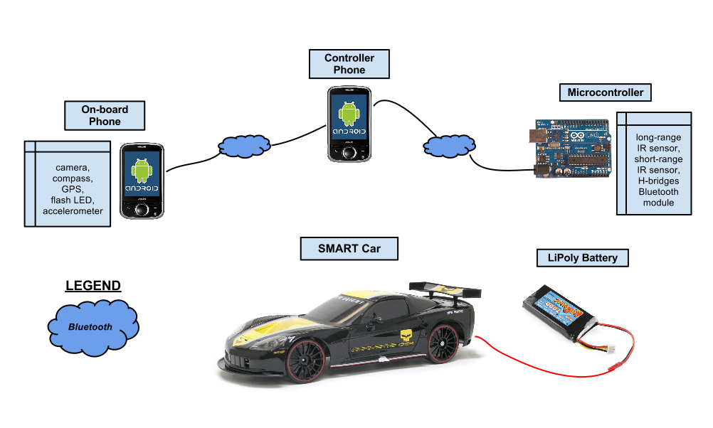
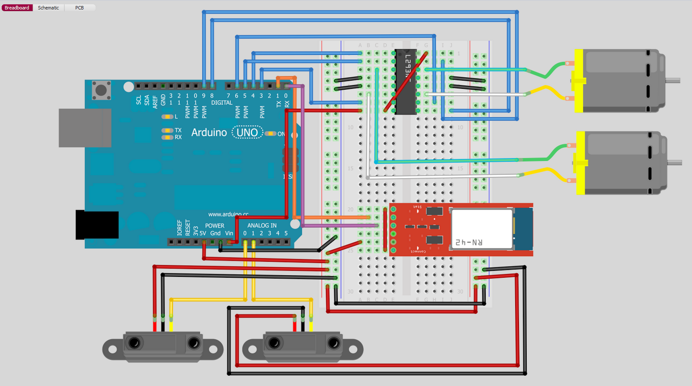
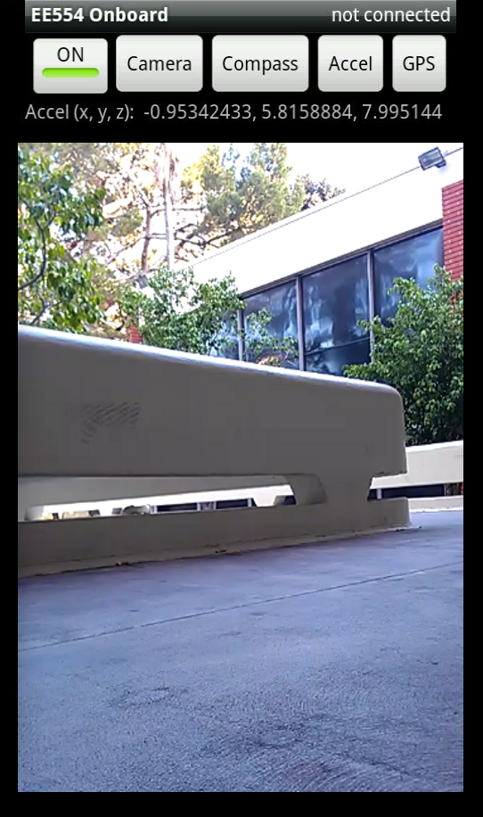
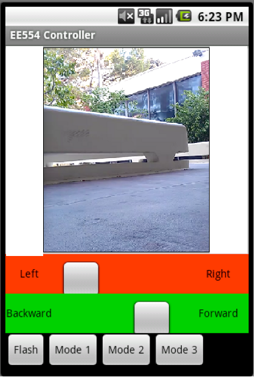
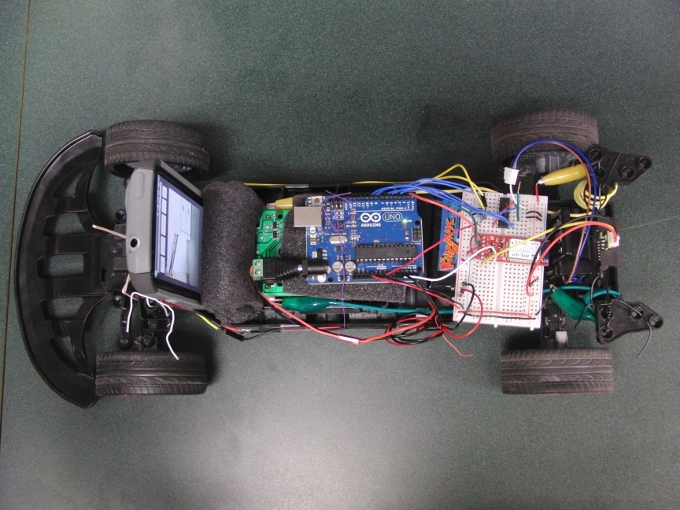

rc-car-collision
================

*A real-time computer system to prevent head-on traffic collisions on a scaled hardware platform consisting of R/C car, microcontroller, and Android-powered smartphones. This project encompassed analog signal processing, Bluetooth communication, motor control, interrupts & scheduling, fault-tolerance & recovery.*

*Developed in Spring 2012 for USC's Real Time Computer Systems (EE545) course. This was a team project completed by A. Hagio, H. Nguyen, L. Sakamoto, and Z. Slavis under the guidance of Prof. Monte Ung.*

Traffic accidents are one of the leading causes of death among humans. It is predicted that by 2020, traffic accidents will exceed HIV/AIDS as a burden of death and disability. And by 2030, it will become the fifth leading cause of death, period. Accidents occur because of humans' inability to react quickly in situations that require fast responses. Furthermore, a human’s reaction time is crippled by physcial impairments such as drug usage, poor eyesight, sleep deprivation, and inexperience. External factors such as poor road conditions, inclement weather, speeding, and distractions (both from inside the vehicle or from the surrounding environment) also play a significant role. The occurrence of accidents is highly dependant on factors relating to human behavior, sensory perception, decision making, reaction speed, awareness, and alertness.
Our solution to the rising problem of road traffic accidents is to reduce human error by employing real-time computer processes for sensing, perception, and reaction. Avoiding traffic collisions is a life-critical task that depends on real-time systems to operate reliably. This system must meet its deadlines in a predictable manner, but also process sensor data correctly to avoid false positive results. We will build a car that can automatically avoid head-on collisions, maintain a constant distance when following another car/object, and allow manual control override by a remote user through a graphical user interface. 

##Hardware##

- analog data sampling from proximity sensors (short/long range infrared) and phone sensors (GPS, accelerometer, compass)
- accurate motor control of the R/C car for collision avoidance (L293NE H-bridge)
- wireless communication (synchronization, queueing) using BlueSMiRF Silver Bluetooth modem to send and receive data streams for motor control and mode configuration from a remote controller smart phone
- multithreaded Android application
- LiPo battery powered

An Android-powered smart phone is mounted to the front of the car, providing the vehicle with a rich collection of high-performance sensors and essentially, a global communications endpoint.  The on-board smart phone runs a mobile application to read data from the various sensors and communicates this information to the controller phone over a Bluetooth connection.  The sensors used are a camera for obtaining visual data, an orientation sensor to measure the car's heading, a 3-axis accelerometer to measure the car's acceleration, and a GPS for determining the car's geolocation, speed, and altitude.  The mobile application also provides access to the camera's dual-LED flash, which can be used as car headlights in low-light conditions.

##Software##

- Amarino toolkit
- Android BluetoothChatService library
- Arduino 

##Demo##

Video

